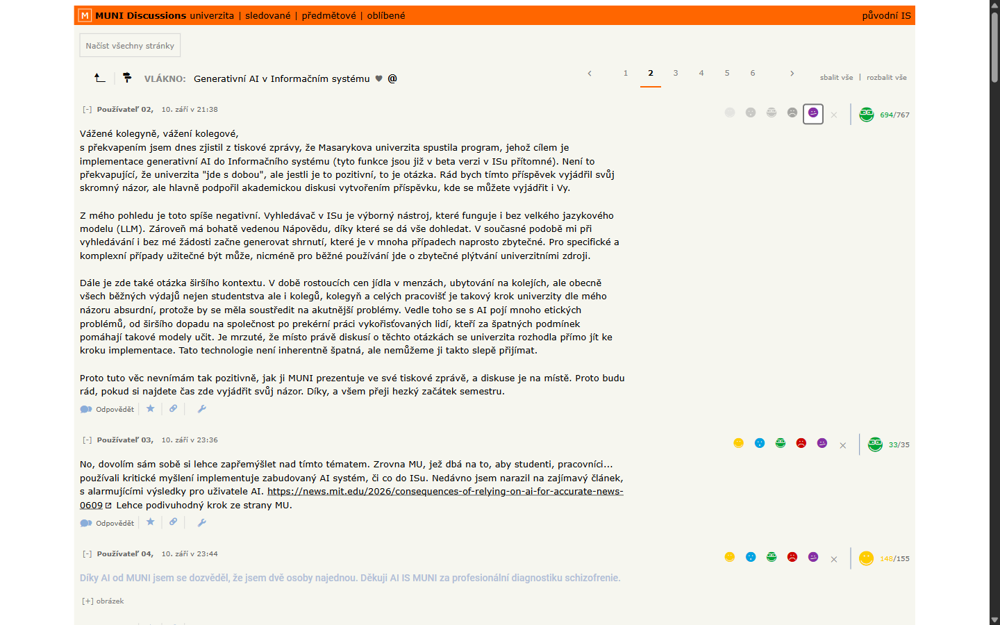
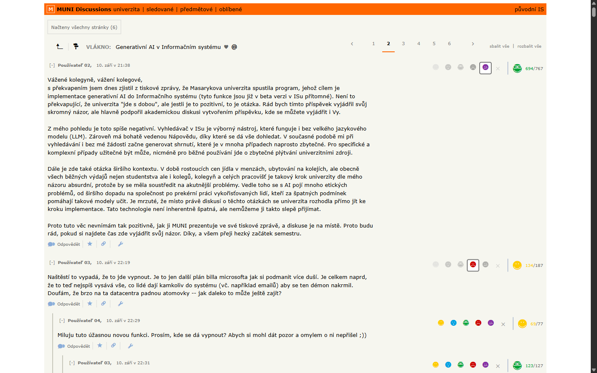
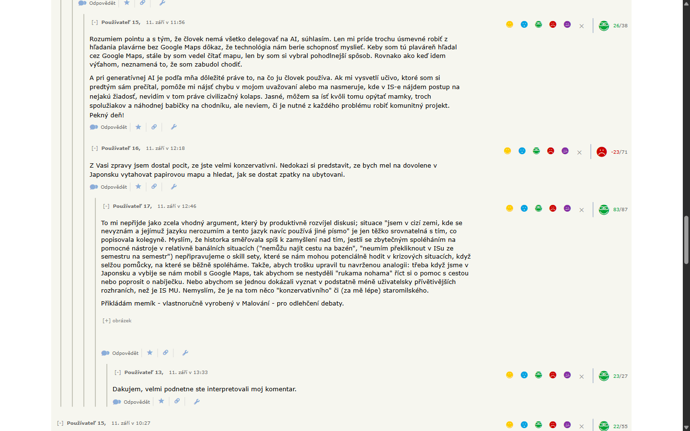
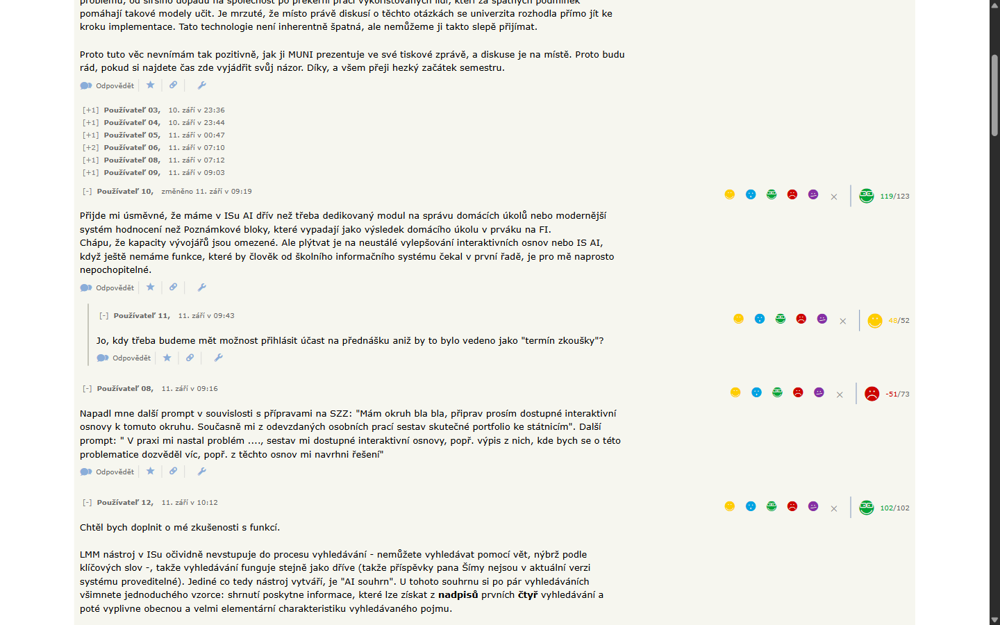

## Restyle Diskusneho Fóra MU
# Features
- prezeranie prispevkov v kompaktnejsom UI
- prednacitanie celeho vlakna, nie je nutne prepinat stranky pri doscrollovani na koniec
- moznost zmensenia prispevkov pomocou minusu vedla mena cloveka
- menu na pridavanie reakcii je rozlozene horizontalne a nie je pod dropdownom
- vertikalne ciary na lepsi prehlad o hlbke zanorenia prispevku

## Ako nainstalovat (Chromium-based only)
1. `chrome://extensions`
2. Zapnite Developer Mode
3. Stiahnite si zbuildovany extension `.zip` z Releases tabu
4. Zip subor rozbalte 
5. V prehliadaci kliknite na `Load Unpacked` a vyberte priecinok ktory obsahuje subor `manifest.json`
6. Otvorte extension ikonu a zapnite pomocou checkboxu
7. Otvorte hocijaku diskusiu v diskusnom fore

## Build locally

Node.js 22 or newer

```
npm install
npm run typecheck
npm run build
```

`npm run package` creates a release zip in `artifacts/`

mená sú pre screenshoty anonymizované





